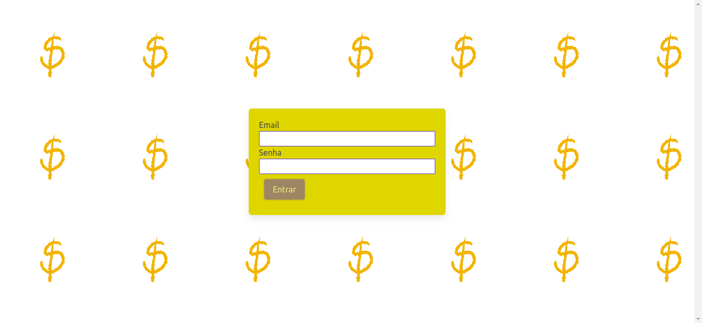
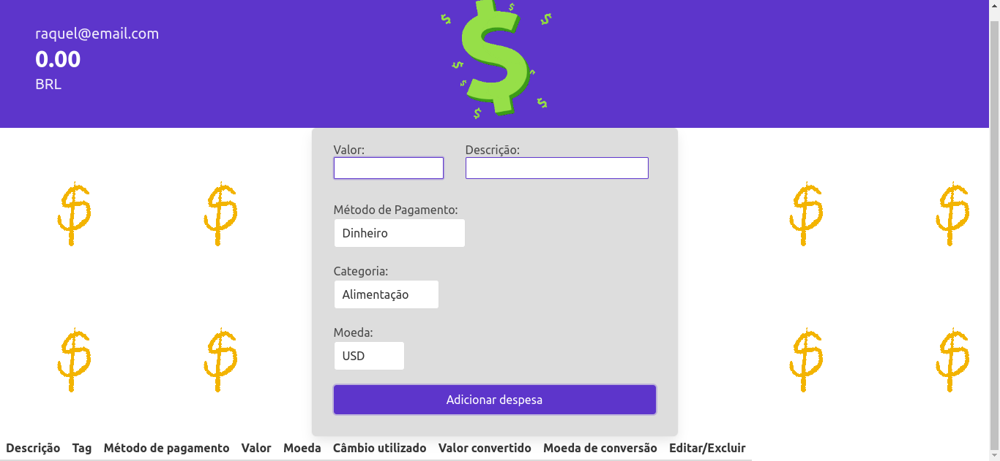

# Project Trybewallet

Este repositório contém o projeto Trybewallet desenvolvido por [Raquel G. C Würzler](https://www.linkedin.com/in/raquel-c-wurzler/) enquanto estudava na [Trybe](https://www.betrybe.com/) no módulo de FrontEnd :rocket:

_"A Trybe é uma escola do futuro para qualquer pessoa que queira melhorar de vida e construir uma carreira de sucesso em tecnologia, onde a pessoa paga quando conseguir um bom trabalho."_

#### Projeto de conclusão da seção 7, no módulo de Front-end

### Principal objetivo:
* Criar uma carteira de controle de gastos com conversor de moedas.

### O que foi entregue:
<details>
  <summary>🤓</summary>
  
  <br />
  
  
  <br />
</details>

### Detalhes desse projeto:
* Projeto feito em React Redux;
* As informações referente as conversões das moedas vem do endpoint https://economia.awesomeapi.com.br/json/all, da API economia.awesomeapi;
* Todo componentizado em arquivos JavaScript;
* Contém duas páginas principais: Login (para fazer login do usuário) e Wallet (para incluir as despesas e ver as conversões);
* Nessa aplicação é possível adicionar despesas escolhendo em qual moeda, qual a forma de pagamento, descrição e o calculo é feito pela aplicação;


##### Arquivos disponibilizados pela Trybe:
* .eslintignore;
* .eslintrc.json;
* .gitignore;
* .npmrc;
* .stylelintignore;
* .stylelintrc.json;
* package-lock.json;
* package.json;
* pasta public;

##### Link Deploy: https://earnest-profiterole-eec6ab.netlify.app/

## Stack utilizada

**Front-end:** JavaScript, React-Redux, CSS, HTML

## Instalação e uso

```bash
# Abra um terminal e copie este repositório com o comando
git clone git@github.com:Raquel-Wurzler/project_trybewallet.git

# Entre na pasta do projeto 
cd project_trybewallet

# Instale as dependências
yarn install
ou 
npm install

# Rode o servidor
npm start

```
